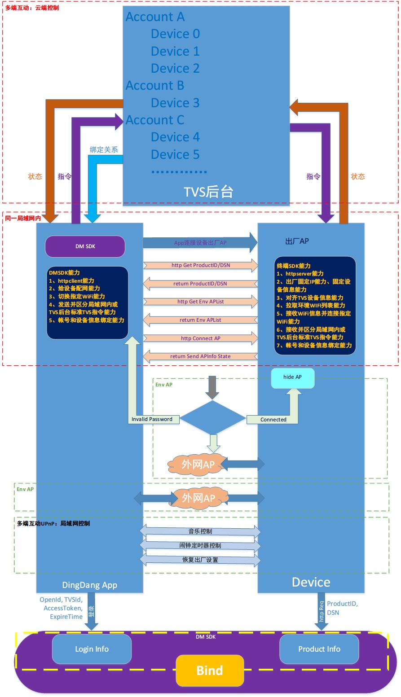

# Android厂商APP接入配置指南

以下流程（从注册AppID到Manifest配置）适用于新接入本SDK，如果您需要从原有的SDK迁移到新版本，请参阅[版本更新日志](版本更新日志.md)，其中有针对每个版本的API变更和就版本迁移指南。**新版本会带来更多特性、修复缺陷，请尽量保持使用最新的SDK版本。**

## 1. 注册AppId

在[微信开放平台](https://open.weixin.qq.com/)和[QQ互联平台](https://connect.qq.com/index.html)注册AppId。

## 2. gradle配置

打开工程app目录下的build.gradle。

### 2.1 defaultConfig

确保defaultConfig下的applicationId为微信开放平台下注册的包名。

### 2.2 signingConfigs

确保signingConfigs目录下storeFile.file参数路径正确，keyAlias、keyPassword、storePassword均与微信开放平台下签名参数一致。

### 2.3 dependencies

配置dependencies：

```groovy
dependencies {
    // ...
    def tvsVer = '2.1.0'
    // 核心模块，必须
    implementation (name: "tvscore-${tvsVer}-release", ext: 'aar')
    // 核心模块依赖微信登录
    implementation 'com.tencent.mm.opensdk:wechat-sdk-android-with-mta:+'
    // DMSDK各模块均依赖OK HTTP
    implementation 'com.squareup.okhttp3:okhttp:3.8.1'
    // AI Speech模块，可选
    implementation (name: "tvsaispeech-${tvsVer}-release", ext: 'aar')
    // QQ音乐会员模块，可选
    implementation (name: "tvsmember-${tvsVer}-release", ext: 'aar')
    // 二维码业务模块，可选
    implementation (name: "tvsqrcode-${tvsVer}-release", ext: 'aar')
    // 音箱配置模块，可选
    implementation (name: "tvsspeaker-${tvsVer}-release", ext: 'aar')
    // TSKM技能服务模块，可选
    implementation (name: "tvstskm-${tvsVer}-release", ext: 'aar')
    // HTML5 WebView模块，可选
    implementation (name: "tvsweb-${tvsVer}-release", ext: 'aar')
    // HTML5 WebView模块依赖appcompat
    implementation 'com.android.support:appcompat-v7:27.1.1'
}
```

### 2.4 flatDir

配置flatDir。

```groovy
android {
    repositories {
        flatDir {
            dirs 'libs'
        }
    }
    // ...
}
```

### 2.5 minSdkVersion

确保minSdkVersion大于等于15。

### 2.6 引用关系配置

如有别的module需要引用这个aar所在的module，需要在另一个module的gradle里配置如下

```groovy
android {
    repositories {
        flatDir {
            dirs project(':[aarmodulename]').file('libs')
        }
    }
}
```

### 2.7 向AndroidManifest.xml注入QQ互联App ID

修改您的应用模块的build.gradle：

```groovy
android {
    defaultConfig {
        manifestPlaceholders = [
                qqOpenAppId: "您的QQ互联AppID"
        ]
        // Code...
    }
    // Code...
}
```

## 3. aar配置

根据需要将aar文件放入app\libs目录下。

## 4. Manifest配置

打开工程AndroidManifest.xml

### 4.1 包名

确保package名称与微信开放平台下注册的包名一致。

### 4.2 Application配置

将application的name改为自定义的Application类，然后在其中的onCreate中加入如下初始化代码：

```java
public class YourApplication extends Application {
    @Override
    public void onCreate() {
        super.onCreate();

        // 初始化TVS账号体系模块，依次传入应用上下文、微信AppID和QQ互联AppID；如果只需要支持一种登录平台，则另一个平台的AppID直接传入空字符串即可
        LoginProxy.getInstance().registerApp(this, "YOUR_WEIXIN_APPID", "YOUR_QQ_OPEN_APPID");
        // 如果要集成HTML5 WebView模块，需要初始化该模块，传入账号认证体系实现类的实例，一般按照下面的方式传入默认实现即可，详见该接口的接口文档
        TVSWeb.init(new TVSAuthDelegate(this, LoginProxy.getInstance()));
    }
}
```

## 5. Q&A

1. 必须接入手机SDK吗？

   是的。无论设备端接的是SDK方案还是云端API的方案，在伴随APP上都需要接入手机SDK，来做帐号授权、设备绑定、音乐服务授权、云端闹钟管理、音色控制选择等操作。

2. 什么时机需要主动触发刷票？

   1. APP启动时；

   2. 从APP给设备传递ClientId之前；

   3. APP需要Token操作的时候。

3. 云端绑定有何作用？

   云端绑定可以作为服务请求合法性校验的一个重要维度，并可以实现APP上设备管理绑定解绑查看等功能，并为推送功能做好基础。

4. APP和设备如何建立连接？

   目前APP的SDK支持三种连接方式，推荐SmartLink方式，在设备SDK端有完整方案

   1. SmartLink

   2. SoftAP

   3. BLE


## 6. 附言：Android厂商APP设备管理接入

### 6.1 开发指南

#### 6.1.1 设备绑定逻辑图



#### 6.1.2 厂商APP接入设备管理系统配置步骤

1. aar配置

   将tvsdevicelib-release.aar，放入app\libs目录下

2. gradle配置

   在build.gradle将以下参数配置在dependencies属性下

   ```groovy
   compile(name:'tvsdevicelib-release', ext:'aar')
   compile 'com.google.code.gson:gson:2.8.1'
   compile 'com.squareup.okhttp3:okhttp:3.8.1'
   ```

3. manifest配置

   1. 确保package名称与微信开放平台下注册的包名一致

   2. 让应用的Application类继承`com.tencent.ai.tvsdevice.DeviceApplication`，添加android:exported=”true”属性。

### 6.2 名词解释

#### 6.2.1 UPnP

通用即插即用 （UPnP） 是一种用于 PC 机和智能设备（或仪器）的常见对等网络连接的体系结构，尤其是在家庭中。UPnP 以 Internet 标准和技术（例如 TCP/IP、HTTP 和 XML）为基础，使这样的设备彼此可自动连接和协同工作，从而使网络（尤其是家庭网络）对更多的人成为可能。

#### 6.2.2 ProductId

产品系列Id，通常在Bot平台生成时即已指定，由AppKey和AppAccessToken组成。

#### 6.2.3 DSN

设备序列号，保证唯一性。
