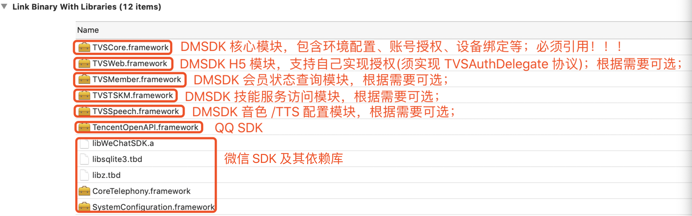
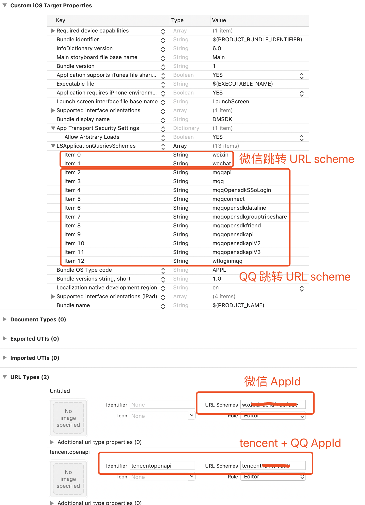
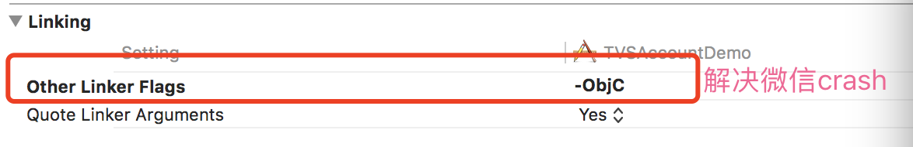

# iOS APP 接入流程

## 1. 注册 AppId

在[微信开放平台][1]和[QQ互联平台][2]注册 AppId。

## 2. Xcode 项目配置

### 2.1 导入依赖库

### 2.2 Search Path 设置

### 2.3 Info.plist 设置

### 2.4 微信 SDK 编译链接问题解决

### 2.5 H5 页面导航栏图片资源问题

如果要调用 H5 页面相关接口，需要在自己 APP project 的 Assets.xcassets 里面建一个名为 `navi_back` 的 Image Set 资源，否则导航栏返回按钮会默认显示文字（不影响功能使用）；
如果自己 app 已经存在导航栏返回按钮图片，则重命名即可复用；

### 2.6 添加日志库依赖

本项目依赖 [CocoaLumberjack][3] 库用于调试日志输出（包括 console 和文件），所以需要在 CocoaPods 中集成，具体配置可参考该项目文档。

[1]: https://open.weixin.qq.com/

[2]: https://connect.qq.com/index.html

[3]: https://github.com/CocoaLumberjack/CocoaLumberjack
