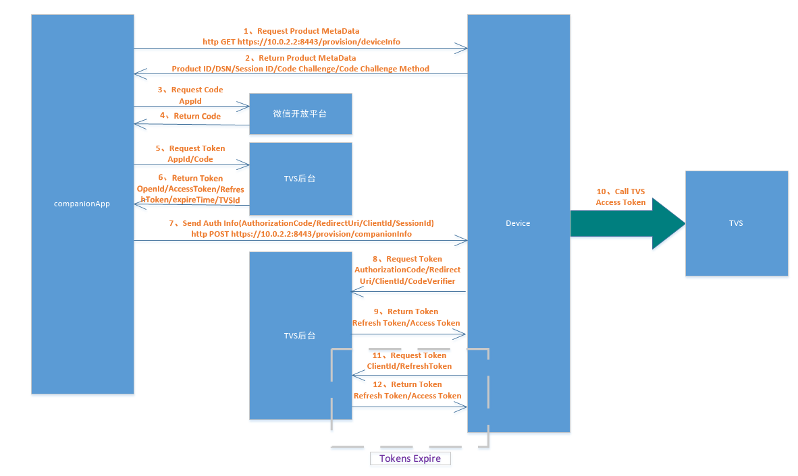
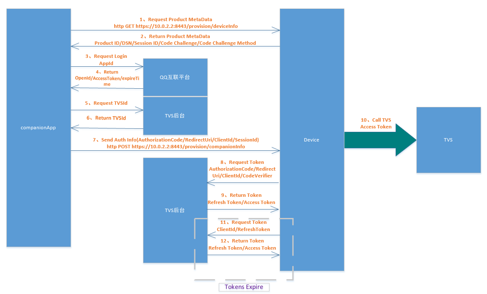

# 厂商APP接入说明 #
## 登录验证流程 ##
TVS（Tencent Voice Service）开放平台的帐号验证和Token传递流程仿照AVS（Alexa Voice Service）的验证流程来进行的。
### 1、厂商APP-LWA（Login With Amazon）-AVS音箱-AVS验证流程 ###

### 2、厂商APP-微信开放平台-TVS后台-TVS音箱-TVS验证流程 ###

### 3、厂商APP-微信开放平台-TVS后台-TVS音箱-TVS验证流程 ###

## 名词解释 ##
#### openid ####
授权用户唯一标识 
#### token ####
票据（Signature）也有时称为“签名”，形象一点，票据其实可以理解为现实世界中的“电影票”、“飞机票”等等，是一种凭证。以电影票为例，我们去看电影需要首先购买电影票，然后拿着电影票在规定的时刻去电影院，检票入场后观看电影。 
#### access_token ####
用户的接口调用凭证 
#### refresh_token ####
用来刷新access_token的票据 
#### expireTime ####
票据过期时间，微信access_token过期时间为7200秒，refresh_token过期时间为30天，QQ互联access_token过期时间为90天 
#### unionId ####
只要是同一个微信开放平台帐号下的移动应用、网站应用和公众帐号，用户的unionid是唯一的。换句话说，同一用户，对同一个微信开放平台下的不同应用，unionid是相同的。 
#### producId ####
同一品类的设备共享一个ProductID，ProductID由bot平台生成，具体格式为appkey:appaccesstoken 
#### dsn ####
设备唯一序列码，每个设备不同，具体规则由厂商自行制定 